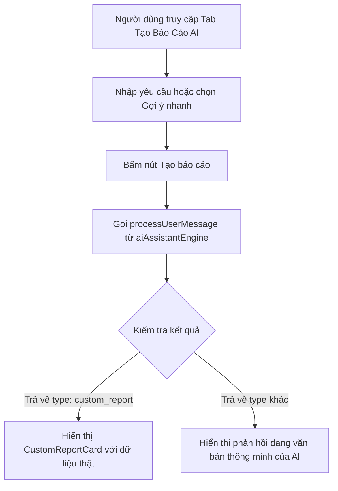

# Kế hoạch tích hợp Tạo Báo Cáo bằng AI (AI Report Generator)

Mục tiêu: Thêm một submenu (Tab) "Tạo Báo Cáo AI" trong module Báo cáo. Tại đây, người dùng có thể nhập yêu cầu bằng ngôn ngữ tự nhiên (hoặc chọn các gợi ý mẫu), hệ thống sẽ sử dụng Trợ lý AI (GloPro AI Engine) để phân tích dữ liệu thực tế và tạo ra các báo cáo trực quan tương ứng.

## 1. Các thành phần cần triển khai

### Menu / Điều hướng (Sidebar Navigation)
- Thêm module `ai_report` vào danh sách `REPORT_MODULES` trong `src/components/reports/ReportLayout.jsx`.
- Sử dụng icon `Sparkles` hoặc `Brain` từ thư viện `lucide-react` làm biểu tượng đại diện.

### Giao diện điều khiển (Tab Component)
- Tạo component mới `src/components/reports/tabs/AiReportTab.jsx`.
- Giao diện bao gồm:
  - **Khung nhập liệu (Prompt Input)**: Textarea được thiết kế đẹp mắt với hiệu ứng chuyển động, hỗ trợ nhập yêu cầu báo cáo.
  - **Các gợi ý nhanh (Quick Suggestions)**: Danh sách các chip gợi ý mẫu (VD: *"Báo cáo doanh thu theo nhân viên"*, *"Khách hàng chi tiêu hàng đầu"*, *"Tổng quan doanh thu & lịch hẹn"*).
  - **Trạng thái xử lý (Loading State)**: Hiệu ứng spinner hoặc biểu tượng AI chuyển động trong lúc phân tích dữ liệu.
  - **Khu vực hiển thị kết quả**: Sử dụng component `CustomReportCard` để vẽ biểu đồ và bảng số liệu thực tế dựa trên kết quả trả về từ công cụ AI.

### Logic tích hợp (AI Processing)
- Sử dụng hàm `processUserMessage` trong `src/lib/aiAssistantEngine.js` để phân tích intent của người dùng và truy vấn dữ liệu thực tế từ cơ sở dữ liệu (Invoices, Customers, Appointments, Staff).
- Hiển thị kết quả dưới dạng thẻ báo cáo tùy chỉnh hoặc đoạn chat phản hồi thông minh nếu yêu cầu không thuộc dạng báo cáo số liệu.

---

## 2. Thiết kế chi tiết & Luồng dữ liệu

---

## 3. Socratic Gate (Câu hỏi mở để xác nhận)

Trước khi tiến hành phát triển thông qua lệnh `/create`, xin bạn hãy phản hồi các câu hỏi sau:
1. Bạn có muốn lưu trữ lịch sử các báo cáo AI đã tạo trong phiên làm việc hiện tại không (để người dùng có thể xem lại các báo cáo đã tạo trước đó mà không cần nhập lại)?
2. Ngoài 3 loại báo cáo chính hiện tại (`staff_revenue`, `top_customers`, `revenue_summary`), bạn có muốn bổ sung thêm các mẫu báo cáo nào khác cho AI xử lý không (ví dụ: báo cáo tồn kho sản phẩm hoặc dịch vụ được sử dụng nhiều nhất)?
3. Thiết kế giao diện nhập liệu dạng khung chat tương tác trực tiếp hay chỉ cần một hộp nhập văn bản đơn giản đặt phía trên trang báo cáo sẽ phù hợp hơn với nhu cầu của bạn?
