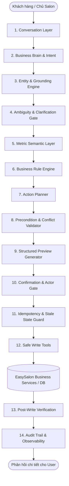
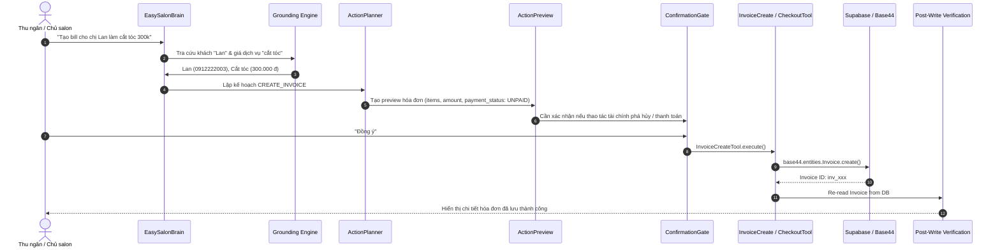

# PHASE 6 ARCHITECTURE SPECIFICATION
## EASY SALON AI AGENT — REAL BUSINESS OPERATIONS

---

## 1. TỔNG QUAN KIẾN TRÚC PIPELINE

Kiến trúc AI Agent EasySalon Phase 6 tuân thủ nghiêm ngặt mô hình 14 tầng bất biến:

---

## 2. METRIC SEMANTIC LAYER (TẦNG PHÂN BIỆT CHỈ SỐ KINH DOANH)

Để ngăn chặn tuyệt đối lỗi nghiêm trọng về nhầm lẫn dòng tiền salon, Metric Semantic Layer chuẩn hóa các chỉ số:

| Chỉ số | Định nghĩa Nghiệp vụ | Nguồn thẩm quyền | Bao gồm (Included) | Loại trừ tuyệt đối (Excluded) |
| :--- | :--- | :--- | :--- | :--- |
| **REVENUE** (Doanh thu) | Tổng giá trị dịch vụ & sản phẩm salon bán ra được ghi nhận sau chiết khấu. | `Invoice` service | Dịch vụ đã làm, Sản phẩm đã bán | **TIP**, VAT thu hộ, Tiền cọc chưa dùng |
| **TIP** (Tiền thu hộ) | Khoản tiền khách hàng thưởng trực tiếp cho nhân viên kỹ thuật. Salon chỉ thu hộ và chi trả lại. | `CashVoucher` (income/type: 'tip') | Tiền tip theo nhân viên | **KHÔNG BAO GIỜ tính vào Doanh thu salon** |
| **PAYMENT** (Thanh toán) | Tổng dòng tiền khách hàng chi trả để tất toán hóa đơn và tiền tip (nếu có). | `Invoice.paid_amount` + Tip | Tiền mặt, Thẻ, Chuyển khoản QR | Công nợ ghi sổ |
| **CASH_FLOW** (Dòng tiền két) | Tổng lượng tiền thực tế đi vào két hoặc tài khoản ngân hàng của salon trong kỳ. | `CashVoucher` ledger | Tiền thu hóa đơn, Tiền tip thu hộ, Thu nợ | Doanh thu ghi nhận nhưng khách nợ |
| **STAFF_REVENUE** | Doanh số định mức dịch vụ/sản phẩm mà nhân viên đó trực tiếp phục vụ để tính KPI/hoa hồng. | `Invoice.items[].assigned_staff` | Doanh thu dịch vụ, Doanh thu sản phẩm | **Tiền TIP của nhân viên** |
| **PAYROLL** | Bảng tính lương và thực nhận của nhân viên trong kỳ tính lương. | `PayrollRun` / Helper | Lương cứng + Hoa hồng + Thưởng + Tip thu hộ - Phạt | Doanh thu salon |

---

## 3. CASHIER & INVOICE WORKFLOW

---

## 4. TIP HANDLING WORKFLOW (HARD BUSINESS RULES)

### A. Tip gộp trong quá trình thanh toán (Invoice + Tip):
* **Hóa đơn:** 1.000.000 đ.
* **Tip:** 200.000 đ cho thợ Minh.
* **Tổng thanh toán của khách:** 1.200.000 đ (qua Cash / Card / QR).
* **Hạch toán:**
  * Doanh thu salon: **1.000.000 đ**.
  * Thu hộ Tip nhân viên Minh: **200.000 đ** (tạo phiếu thu tiền `tip`).
  * Tuyệt đối không cộng 200k vào doanh thu salon.

### B. Tip phát sinh sau khi hóa đơn đã thanh toán (Post-Paid Tip):
* **Hóa đơn:** Trạng thái `PAID` (1.000.000 đ).
* User yêu cầu: "Khách tip thêm 200k tiền mặt cho Minh".
* **Xử lý chuẩn:**
  1. Giữ nguyên hóa đơn ở trạng thái `PAID` (không revert sang UNPAID, không sửa hóa đơn).
  2. Tạo bản ghi thu hộ độc lập thông qua `CashVoucher` loại `tip`.
  3. Gắn `employee_id: Minh`, `payment_method: 'cash'`, `flow: 'income'`.
  4. Ghi nhận tiền vào dòng tiền két (+200.000 đ), tăng sổ theo dõi tiền tip của Minh (+200.000 đ). Doanh thu salon hoàn toàn không đổi.

---

## 5. INVENTORY & WAREHOUSE MANAGEMENT

* Phân tách rành mạch giữa tra cứu tồn kho (`READ_STOCK`) và điều chỉnh tồn kho (`RECEIVE_STOCK` / `ADJUST_STOCK`).
* Mọi hành động tăng/giảm kho:
  1. Kiểm tra quyền nhân viên (`PermissionGate`: role `owner`, `manager` hoặc có quyền `inventory`).
  2. Xác định sản phẩm trong DB thật qua `Product.list()`.
  3. Tạo Action Preview: `oldStock` -> `delta` -> `newStock`.
  4. Cập nhật và kích hoạt `Post-Write Verification` đọc lại DB để xác nhận tồn kho mới.

---

## 6. SELF-CORRECTION & ORCHESTRATION FALLBACK

Khi thực thi multi-step action (ví dụ: *"Đặt lịch cho Lan lúc 3h với Minh, nếu Minh bận thì tìm thợ khác"*):
1. **Bước 1:** Kiểm tra lịch hẹn của nhân viên ưu tiên (Minh).
2. **Bước 2:** Nếu phát hiện xung đột lịch (`CONFLICT`):
   * Tự động kích hoạt cơ chế `FIND_AVAILABLE_STAFF`.
   * Lọc danh sách nhân viên cùng chuyên môn đang rảnh trong khung giờ đó.
   * Cập nhật kế hoạch gán thợ thay thế kèm thông báo minh bạch cho người dùng.
3. **Bước 3:** Nếu toàn bộ salon kín lịch, thông báo cụ thể lý do và gợi ý các khung giờ trống kế tiếp.
